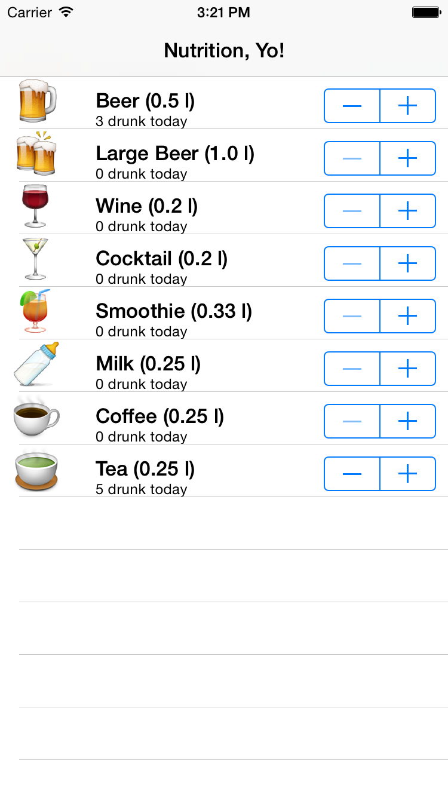
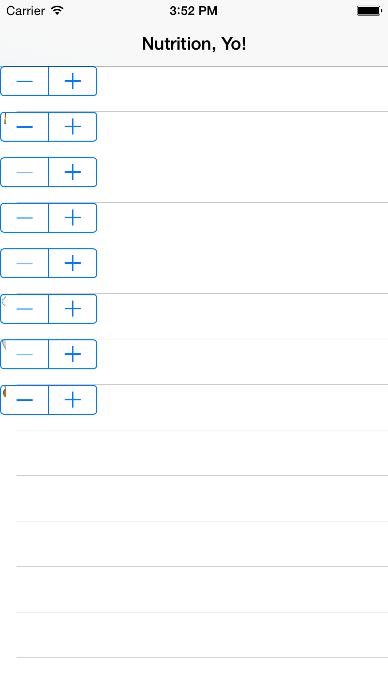

# FBSnapshotTestCase
## __@pietbrauer__

---

# Who developed an app before?

---


# Who wrote tests for it?

---

# Why didn't you?

---

# __You wanted to get your killer App idea on Kickstarter ASAP__

---


# __Winners don’t test__

---

# __Most is view code is hard to test__

---

# __What do I mean with that?__

---

# Our app



^
Given you have a fairly simple list
Lists all beverage you drank today and stores them in HealthKit
Also fully tested

---

# We have ...

* a simple `UITableViewController` setup
* a `Beverage` model
* a `BeverageCell` cell that displays data

---

# We want to ...

* test cell interactions
* setting texts on labels
* interacting with the stepper
* view layout code

---

# Model tests

```swift
func testBeer() {
  let subject = Beverage.Beer
  XCTAssertEqual(subject.amount, 0.5)
  XCTAssertEqual(subject.description, "Beer (0.5 l)")
  XCTAssertEqual(subject.emoji, "🍺")
}
```

---

# Model logic tests

```swift
func testSettingAmountDrunk() {
    var subject = Beverage.Tea
    // reset units drunk
    subject.unitsDrunk = 0
    XCTAssertEqual(subject.unitsDrunk, 0)
    // set new value
    subject.unitsDrunk =  5
    XCTAssertEqual(subject.unitsDrunk, 5)
    // Take other instance of tea and check if same amount applies
    let secondSubject = Beverage.Tea
    XCTAssertEqual(subject.unitsDrunk, 5)
}
```

---

# Cell View tests

```swift
func testCellConfiguration() {
  var beverage = Beverage.Beer
  beverage.unitsDrunk = 3
  let subject = BeverageCell(style: .Default, reuseIdentifier: nil)
  subject.configure(beverage)

  XCTAssertEqual(subject.beverageEmojiLabel.text!, "🍺")
  XCTAssertEqual(subject.beverageNameLabel.text!, "Beer (0.5 l)")
  XCTAssertEqual(subject.amountDrunkLabel.text!, "3 drunk today")
  XCTAssertEqual(subject.stepper.value, 3)
}
```

---

# Cell Logic tests

```swift
func testStepper() {
  var beverage = Beverage.Beers
  beverage.unitsDrunk = 0

  let subject = BeverageCell(style: .Default, reuseIdentifier: nil)
  subject.configure(beverage)

  // Set stepper value
  subject.stepper.value = 5
  subject.stepperStepped(subject.stepper)

  // Expect that the amount drunk label has the right value
  XCTAssertEqual(subject.amountDrunkLabel.text!, "5 drunk today")
}
```

---

#


---

#


---

# Actual app



---

# What to do?
## __Write snapshot tests__

---

# Installation

```ruby
# Cartfile
github "facebook/ios-snapshot-test-case" >= 2.0
```

```ruby
# Podfile
pod "FBSnapshotTestCase", ">= 2.0"
```

---

# Usage

1. `import FBSnapshotTestCase`
2. Inherit from `FBSnapshotTestCase`
3. In `setUp()` set `recordMode = true`
4. Run unit tests
5. Remove `setUp()`

---

# Demo

---

#


---

# Links

* *FBSnapshotTestCase*: https://github.com/facebook/ios-snapshot-test-case
* *Demo project*: https://github.com/pietbrauer/Beverages
* *Snapshots Xcode plugin*: https://github.com/orta/snapshots

---

# Thanks

Twitter: @pietbrauer
Blog: nerdishbynature.com/blog
